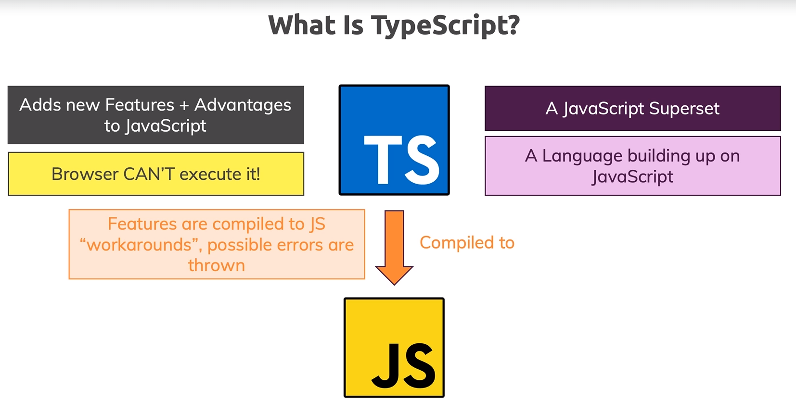
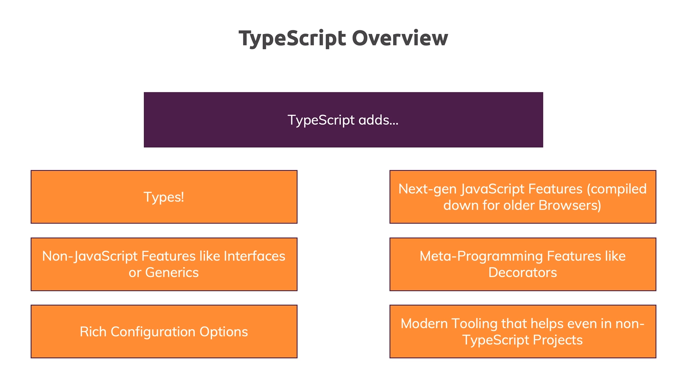
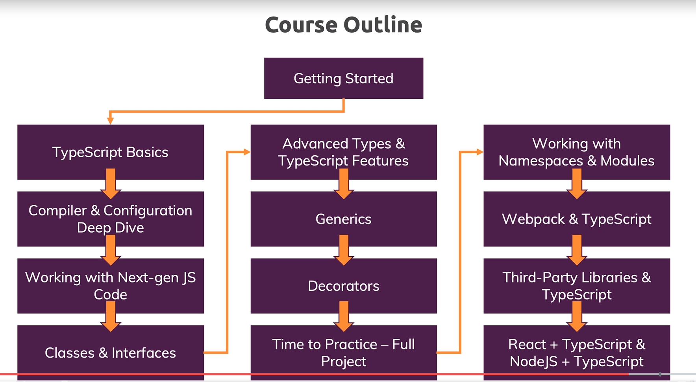

Section 01: Getting Started
================

Index
---------------------------------
1. Intro 
2. What Is TypeScript & Why Should You Use It?
3. Installing & Using TypeScript
4. TypeScript Advantages Overview
5. How To Get The Most Out Of The Course
6. Setting Up A Code Editor / IDE
7. The Course Project Set Up

What Is TypeScript & Why Should You Use It?
---------------------------------
To check what is TypeScript lets use the next diagram:



So, first of all TypeScript is a JavaScript/ES6 super set, whose most important feature is the introduction of strongly types. This means that TypeScript is a language building up on JavaScript that add new features and advantages. Second aspect, TypeScript can't be run in the browser, then the TypeScript features are compiled to JavaScript "workarounds", possible errors are thrown. This means that TypeScript have a compiler that we will review in the coming sections.

The TypeScript community has enable a [playground](www.typescriptlang.org/play/index.html) for get the equivalences between TypeScript and JavaScript. The invitation is make to check the link and start with your sniff in TypeScript.

Now, why should you use TypeScript. Lets check the next code sample:

```js
function add (num1, num2) {
    return num1 + num2;
}

console.log(add('2', '3')); // prints 23
```

Unfortunately, JavaScript is weak typed, and this feature expose us to unwanted behaviors at runtime, just like the previous example. Here the expected act is get the 5 as consequence of the arithmetic sum, but we get 23, because JavaScript interpret the parameters as strings and then apply string concatenation. So, to avoid this accidental behavior we should apply mitigation strategies like add a `if` check to the `add` function, then validate and sanitize the user input. However, this action makes that developers can still write invalid code! With TypeScript we are not exposed to these risks. 

Installing & Using TypeScript
---------------------------------
Let's review a simple case to check how to install TypeScript and then use it. First, let's define a markup with two inputs and the association to a script file:

```html
<html>
<head>
    <script type="text/javascript" src="exercises/javascript_add.js" defer></script>
</head>
<body>
    <input id="num1" type="number" value="" placeholder="Number 1"/>
    <input id="num2" type="number" value="" placeholder="Number 2"/>
    <button>Add!</button>
</body>
</html>
```

Now let's put the `add` function logic in the script, using the input values that the user will give us from the html:

```js
const button = document.querySelector("button");
const input1 = document.getElementById("num1");
const input2 = document.getElementById("num2");

function add(num1, num2) => num1 + num2;

button.addEventListener("click", function() {
    console.log(add(input1.value, input2.value));
});
```

When we run this code, JavaScript will apply the string concatenation, because the `.value` method of the elements in the DOM always return strings. Therefore, we will get an unexpected result from the logic business perspective, since our goal is apply the arithmetic sum. Let's fix this script with pure JavaScript:

```js
const button = document.querySelector("button");
const input1 = document.getElementById("num1");
const input2 = document.getElementById("num2");

function add(num1, num2) => {
    if (typeof num1 === "number" && typeof num2 === "number") {
        return num1 + num2;
    } else {
        return +num1 + +num2;
    }
}

button.addEventListener("click", function() {
    console.log(add(input1.value, input2.value));
});
```

Now, we have a condition to validate the type of the inputs. If the condition is `false` we use the implicit cast `+num1` to convert the `string` in a `number`. This solution works, but it is overworked.

Time to install TypeScript and use it. First of all, it is required install Node.js to can use the `npm` package manager. Once installed `npm` we can run:

```
$ npm install -g typescript
```

This command will install the TypeScript compiler and all the necessary dependencies to start our development with this super set. Now lets create a `typescript-add.ts` file an let's implement the logic for the `add` function:

```ts
const button = document.querySelector("button");
const input1 = document.getElementById("num1")! as HTMLInputElement;
const input2 = document.getElementById("num2")! as HTMLInputElement;

function add(num1: number, num2: number): number {
    return num1 + num2;
}

buttoe.addEventListener("click", function() {
    console.log(add(+input1.value, +input2.value));
});
```

> Note: This code just have sense on `.ts` files. If you put it in a `.js` file we will fall in a errors sequence

Much cleaner! Important thing here. First, when you install the TypeScript package your editor will use the compiler to share you several things about your current code. For this case, initially we get a compiler error for the `input1.value` parameter, saying that this value could be undefined and we are not considering that scenario. It is for that reason that we add the `!` in our DOM elements. With this syntax we are saying to the TypeScript compiler that this values always will exist.

Second we start to use Types! The `HTMLInputElement` in our DOM elements and the `number` in the parameters of the `add` function, are types that reinforce the legibility of the code. Finally, check that in the log line we use the implicit cast `+input1.value` to send a `number` to the `add` function and not a `string`. 

Now lets compile our file. For this sample we have to run:

```
$ tsc exercises/typescript-add.ts
```

This command will generate a `typescript-add.js` file, that is the compiled version of our `typescript-add.ts` file. We can sniff the contents of this file to check what was the work of the TypeScript compiler. The last thing we should do is update the script path in our HTML file. Now we can see an example created with TypeScript.

TypeScript Advantages Overview
---------------------------------
The next figure show us the advantages that TypeScript offer to our development:



Types let us write clean code and we will more explicit about how things work to avoid many unexpected and unnecessary errors. Moreover, we can profit the features from moderns IDEs that support types, like auto completion and built in errors which show before we even compiled a code.

With TypeScript we have access to next generation JavaScript features which you can write an use in our TypeScript files and then they will get compiled down to work around older browsers. Similar to Babel, with TypeScript we can use modern JavaScript features and still produce and ship code that works in older browsers as well.

The use of types enable us certain features which only types could understand like *interfaces* or *generics*. These features cannot be compiled to JavaScript but they do not have to because they are features that help us during development.

In the same way, types open us meta programming features like *decorators*. We will dive in this feature in their respective section.

For other side, the TypeScript compiler is customizable because it comes with a large list of configurable options that are complemented with our IDE. These modern tooling help us to review the project configuration even in non TypeScript projects.

So, as you can see there are many reasons for using TypeScript,

How To Get The Most Out Of The Course
---------------------------------
Below, we have the course road map that will be useful to establish the guidelines of our TypeScript Learning:




Also, here are some tips that will help you to get the most out of the course:

- Watch the videos at your speed
- Code along, pausing and rewinding
- Practice on you own
- Debug and search your errors
- Use the Ask & Answer tab

Setting Up A Code Editor / IDE
-------------------------------

The recommended code editor is:
- [VSCode](https://code.visualstudio.com)

These plugins will help you with the setup of your IDE:

- [ESLint](https://marketplace.visualstudio.com/items?itemName=dbaeumer.vscode-eslint)
- [Prettier](https://marketplace.visualstudio.com/items?itemName=esbenp.prettier-vscode)
- [Path Intellisense](https://marketplace.visualstudio.com/items?itemName=christian-kohler.path-intellisense)

The Course Project Set Up
---------------------------------
Check the folder structure of the `project` directory. Important things to mentions, this project was built with the next command:

```
$ npm init
```

Also to avoid reload the browser every time we do a change we recommend install the next package:

```
$ npm install --save-dev lite-server
```

And then, add the next line in the `package.json` file of the projects:

```json
...
  "scripts": {
    "test": "echo \"Error: no test specified\" && exit 1",
    "start": "lite-server"
  },
```
